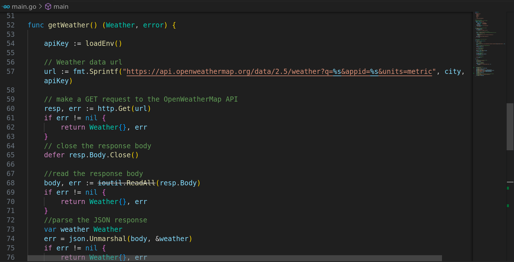
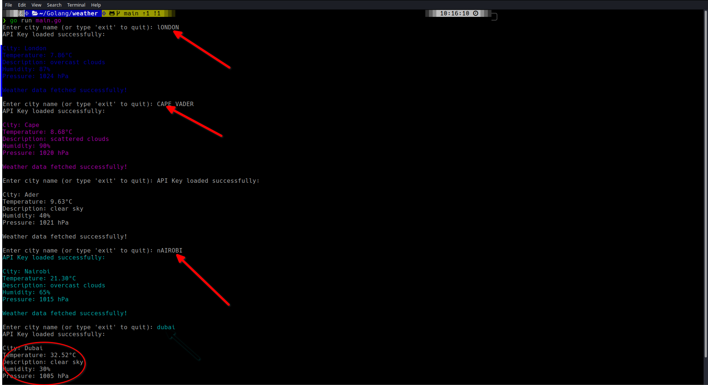
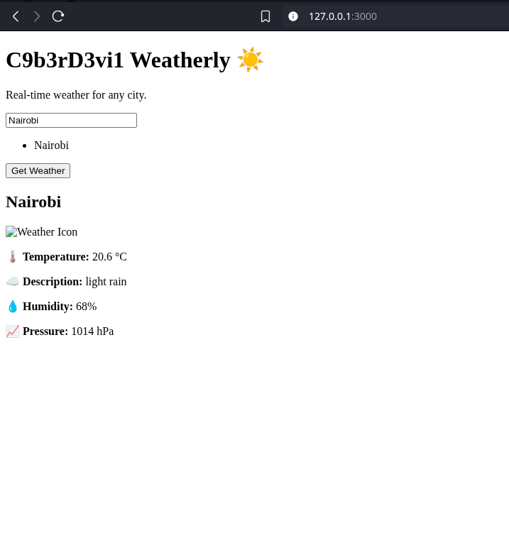

# Weatherly - Real-Time Weather Application (Go Backend + React Frontend)

Weatherly is a full-stack weather application that allows users to check real-time weather information for any city. The application consists of a **Go backend** serving weather data via an API and a **React frontend** that displays the data to users. The app uses the OpenWeatherMap API to fetch weather information and is styled using Tailwind CSS and DaisyUI for a modern, responsive interface.

## Table of Contents

- [Project Description](#project-description)
- [Features](#features)
- [Technologies Used](#technologies-used)
- [Getting Started](#getting-started)
  - [Backend Setup](#backend-setup)
  - [Frontend Setup](#frontend-setup)
  - [Running the App](#running-the-app)
- [Usage](#usage)
- [Project Structure](#project-structure)
- [Contributing](#contributing)
- [License](#license)
- [Acknowledgments](#acknowledgments)

## Project Description

Weatherly is a full-stack application designed to provide users with real-time weather information for any city. It is built with:

- **Go** for the backend that fetches weather data from OpenWeatherMap.
- **React** for the frontend that displays the weather data with features like autocomplete search, weather display, and theme toggle (light/dark).
  
### Key Features:

- **City Search with Autocomplete**: Dynamically search for cities with autocomplete suggestions.
- **Weather Data**: Fetch real-time weather details like temperature, humidity, pressure, and wind speed.
- **Weather Icons**: Displays weather icons corresponding to the current conditions.
- **Responsive Design**: Fully responsive design using Tailwind CSS and DaisyUI.
- **Theme Toggle**: Light and dark mode support based on system preferences.

## Technologies Used

### Backend (Go)

- **Go (Golang)**: For the backend server.
- **OpenWeatherMap API**: For fetching weather data.

### Frontend (React)

- **React**: For building the user interface.
- **Tailwind CSS**: For utility-first CSS styling.
- **DaisyUI**: For pre-built Tailwind CSS components.
- **TypeScript**: For type safety in React.
- **Axios**: For making API requests to the Go backend.

## Getting Started

### Backend Setup (Go)

To run the Go backend, you need to have Go installed on your machine. If Go is not installed, follow the instructions [here](https://golang.org/doc/install).

#### 1. Clone the repository

    git clone https://github.com/C9b3rD3vi1/weather.git

    cd weather

2. Install dependencies
Go does not have a package manager, so you can install the required libraries using go get if needed. Assuming you are using gin-gonic for handling HTTP requests, install it:

    go get github.com/gin-gonic/gin

3. Create a .env file for your OpenWeatherMap API key

In the backend folder, create a .env file and add your OpenWeatherMap API key:

    OPENWEATHERMAP_API_KEY=your-api-key-here

4. Running the Backend

Start the Go server by running:

    go run main.go

This will start the backend API, typically running on http://localhost:8080. The Go backend will listen for weather queries and fetch data from OpenWeatherMap.

Frontend Setup (React)

1. Install Node.js
If you don’t have Node.js installed, follow the instructions here.
<https://nodejs.org/en>

2. Install dependencies
In the frontend folder, install the necessary dependencies by running:

    npm install

or if you use Yarn:

    yarn install

3. Setup API URL

In the frontend, ensure the API URL is pointing to your Go backend. Create a .env file in the frontend folder and add the backend API URL:

REACT_APP_BACKEND_API_URL=http://localhost:8080

4. Running the Frontend

Start the React development server by running:

    npm start

or if you use Yarn:

    yarn start

This will start the frontend on <http://localhost:3000>, which will communicate with the Go backend to fetch and display weather data.

Running the Full App (Both Backend and Frontend)
To run both the backend and frontend locally:

Start the Go backend:

    go run main.go

Start the React frontend:

    npm start\

Your app should now be accessible at <http://localhost:3000>, and the frontend will communicate with the backend for weather data.

Usage
Search for a city: Type the name of a city into the search input. Autocomplete suggestions will appear as you type.

View Weather: Once a city is selected, the weather data (temperature, humidity, pressure, etc.) will be displayed.

Theme Toggle: Switch between light and dark mode using the theme toggle button.

Project Structure

    /weatherly
    ├── /backend
    │   ├── main.go                # Go server and API logic
    │   ├── .env                   # Environment variables (OpenWeatherMap API key)
    │   └── go.mod                 # Go module dependencies
    │
    ├── /frontend
    │   ├── /public                # Public assets (e.g., index.html)
    │   ├── /src
    │   │   ├── /components        # Reusable UI components (WeatherCard, etc.)
    │   │   ├── /services          # API calls and weather logic
    │   │   ├── App.tsx            # Main app component
    │   │   ├── index.tsx          # React entry point
    │   ├── package.json           # React project metadata and dependencies
    │   └── .env                   # Environment variables (Backend API URL)
    │
    ├── README.md                  # This file
    └── LICENSE                    # Project license (MIT or other)

/backend
Contains all Go-related code, including the server (main.go) and environment configurations. It listens for weather requests and fetches data from OpenWeatherMap.

/frontend
Contains all React-related files, including components, services, and the main application code.

Contributing
I welcome contributions to this project! Here’s how you can get started:

Fork the repository and clone it to your local machine.

Create a new branch for your feature:

    git checkout -b feature/your-feature-name

Make your changes and commit them:

    git commit -m "Add your commit message"

Push to your fork:

    git push origin feature/your-feature-name

Create a pull request with a detailed explanation of your changes.

License
This project is licensed under the MIT License - see the LICENSE file for details.

Acknowledgments
OpenWeatherMap: For providing free weather data APIs.

Tailwind CSS: For utility-first CSS framework.

DaisyUI: For the useful Tailwind CSS plugin for pre-built components.

React: For a powerful and flexible front-end framework.

Go (Golang): For a simple, fast backend.
